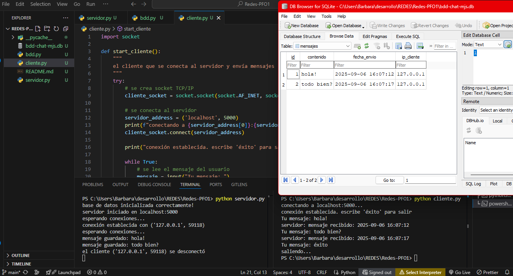

# Práctica Formativa Obligatoria N°1

## Chat Básico Cliente-Servidor con Sockets y Base de Datos

Implementación de un sistema de chat básico utilizando sockets TCP/IP en Python, con almacenamiento persistente en base de datos SQLite

### Características

* Servidor Socket: Escucha en localhost:5000
* Base de Datos SQLite: Almacena mensajes con timestamp e IP del cliente
* Manejo de Errores: Gestión robusta de excepciones y conexiones
* Múltiples Clientes: Soporte para conexiones concurrentes
* Interfaz de Línea de Comandos: Fácil de usar y probar

### Instalación y Uso

* Clonar

   ```bash
   git clone https://github.com/barviz/Redes-PFO1.git
   ```

* Ejecutar el Servidor (Terminal 1 - Servidor):

   ```bash
   python server.py
   ```

* Ejecutar el Cliente (Terminal 2 - Cliente):

   ```bash
   python client.py
   ```

* Escribir "éxito" para terminar


###

